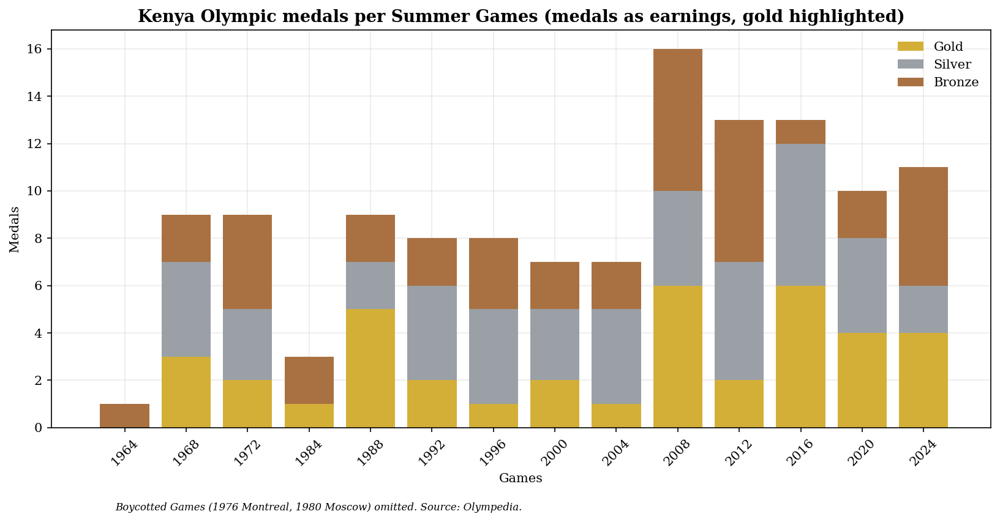

# Kenya at Gold

**An open, structured, source-linked dataset connecting Kenya's Olympic medal record to its governance, doping, welfare, and policy history — built to be queried, visualized, modeled, and cited.**

Kenya has won **124 Olympic medals** (39 gold, 45 silver, 40 bronze through Paris 2024), the highest of any African nation, and nearly all of them from distance running. That story is told everywhere. What isn't told, in any single structured place, is the connective tissue: the diverted sponsorship funds, the anti-doping collapse and recovery, the athletes who die broke or violently, the training system that produces world records in villages with no track, and what the state actually does with the reputational capital its runners generate.

This repository is that place. It treats **every medal as a separately catalogued earning** — with the year, the person(s) awarded, and the surrounding context — and gives **gold medals the highest level of detail**, because the gold is the unit around which the whole national narrative is built.

## What makes this different from anything else out there

I looked. Olympic datasets are common on GitHub and Kaggle; none are Kenya-specific, and none go past medal counts. The academic literature on Kenyan running (Onywera, Pitsiladis, Tucker and others) is rigorous but answers a physiological and sociocultural question, not a governance one. So this repo adds four things I haven't seen done anywhere else, for this country or this sport:

1. **A governance network graph** (`notebooks/02_network_analysis.py`) — officials, athletes, and incidents as a graph instead of a list, so recurrence across scandals is visible rather than buried in separate news stories.
2. **A governance-vs-medals overlay** (`notebooks/03_governance_density.py`) — gold medal counts and documented incident density plotted on the same timeline per Games cycle, so the relationship (or its absence) is something you can look at, not something asserted.
3. **A transparent Governance Response Scorecard** (`notebooks/04_governance_scorecard.py`) — for each era, a plain count of documented problems against documented institutional responses, with every item listed out rather than compressed into an opaque single score. The 2021-2025 era's response ratio (1.67, versus 0.4 in 2016-2020) is the kind of number a sports ministry, a NOC, or an oversight committee could actually use.
4. **An interactive single-file dashboard** (`viz/dashboard.html`) — open it in any browser, no server needed. Medal history, gold concentration by event, and a filterable governance/doping timeline, all from the same open data. Built for fans and enthusiasts as much as for researchers.

## What's in here

```
data/
  medals_by_games.csv       Per-Games gold/silver/bronze totals, 1956-2024 (verified, Olympedia)
  golds.csv                 Every one of the 39 golds, individually catalogued (the highlight)
  all_medals.csv            Every medal as one row; golds verified, silver/bronze via builder
  build_all_medals.py       Reproducible scraper that completes all_medals.csv from source
  controversies.json        Sourced governance/doping/welfare incidents
  policy_timeline.csv        Government actions and real budget figures by year
  funding_vs_output.csv      Medals vs doping context vs funding, per Games
  governance_scorecard.csv   Output of the transparent scorecard (see below)
  corpus_labels.jsonl        REAL labelled news corpus for the ML classifier
  geo/
    kenya_counties.csv       County reference (region, coordinates)
    medalist_origins.csv     Athlete -> birthplace county (verified seed)
  build_medalist_origins.py  Reproducible builder that enriches origins from source
nlp/
  collect_corpus.py          Fetches article text (robots-aware, rate-limited, gitignored cache)
  train.py                   Trains + cross-validates the classifier on the corpus
  controversy_classifier.py  Inference wrapper; load_trained() uses the real model
notebooks/
  01_medal_analysis.py      Reproducible core analysis; regenerates figs 1-4
  02_network_analysis.py    Governance network graph (fig 5) — novel angle #1
  03_governance_density.py  Medals-vs-incidents overlay (fig 6) — novel angle #2
  04_governance_scorecard.py Transparent scorecard — novel angle #3
docs/
  methodology.md            Sourcing rules and confidence model
  literature-review.md       How this positions against existing scholarship
  data-schema.md            Field definitions for every dataset
  concept.md                Full concept and reframing
manuscript/                 Draft academic publication
viz/                        Generated charts + dashboard.html — novel angle #4
sources/                    Citation manifest
```

## Headline analytics (all from the datasets, reproducible)

Running `python notebooks/01_medal_analysis.py` regenerates these from the raw CSVs:

- **97.4%** of Kenya's Olympic golds are in athletics; the only exception is Robert Wangila's 1988 boxing gold.
- **25.6%** of golds have been won by women — every one of them since Pamela Jelimo in 2008.
- **11 of 39 golds** are in the men's 3000m steeplechase alone — the single most productive event in Kenyan Olympic history.
- Best-ever haul: **16 medals at Beijing 2008**; joint-best gold count: **6, at both Beijing 2008 and Rio 2016**.



## The ML dimension

This is not a static archive. The `nlp/` pipeline **classifies real news coverage** into controversy categories — corruption, doping, anti-doping governance, welfare/gender, geopolitics, migration — so the `controversies.json` timeline can update from evidence rather than manual curation. It trains on `data/corpus_labels.jsonl`, a corpus of **real published articles** (BBC, AP, Sports Illustrated, Daily Nation, World Athletics and others), not a synthetic seed set. `collect_corpus.py` fetches full article text at runtime (robots-aware, rate-limited, cached locally and never committed for copyright reasons); `train.py` cross-validates and reports honest per-class metrics.

The baseline is deliberately transparent (TF-IDF + logistic regression) and its numbers are reported honestly: strong on the well-populated classes (doping, corruption), weak on classes with only two examples — which is the correct behaviour of a small-corpus baseline and the reason "grow the corpus" is the documented next task. The interface is model-agnostic, so a fine-tuned transformer drops in later. See `nlp/README.md`.

Analytical layers (see `docs/methodology.md`): time-series of funding vs medal output vs sanction counts, geospatial clustering of medalist origin (via `data/geo/`) against county indicators, and network analysis of officials/federations/sanctioned athletes to show how few names recur across scandals.

## Data integrity

Every row carries a `source`, and every claim in `controversies.json` carries a `confidence` level reflecting the strength of public documentation. **No synthetic data is used anywhere.** Where sources disagree — for example, Olympedia records Kenya's totals as 39-45-40 while some Wikipedia tables show 39-44-41, owing to differing treatment of relay and boxing medals — the discrepancy is recorded, not silently resolved. See `docs/methodology.md`.

## Licensing

- **Code** (`nlp/`, `notebooks/`): MIT.
- **Data and documentation** (`data/`, `docs/`): Creative Commons Attribution 4.0 (CC-BY 4.0), so the dataset is freely reusable and citable with attribution.

## Citing this work

A versioned release will be archived on Zenodo with a DOI (see `CITATION.cff`). Until then, cite the repository directly. A Country Profile draft for *International Journal of Sport Policy and Politics* is in `manuscript/`.

## Setup

See `SETUP.md` for Colab and Termux commands to run the analysis, the data builders, and the classifier trainer.

## Status

- **Medal spine** — complete and verified. `medals_by_games.csv` and all 39 golds in `golds.csv` are done.
- **Per-medal expansion** — `all_medals.csv` holds the 39 verified golds plus sourced anchor rows; the remaining silver/bronze rows are completed by running `data/build_all_medals.py` against source (a committed, reproducible scraper — chosen over hand transcription precisely to avoid memory-based errors). Running it requires network access.
- **Geospatial** — `data/geo/` ships a factual county reference and a verified origin seed; `build_medalist_origins.py` enriches per-athlete birthplaces from Wikipedia infoboxes, mapping to counties and flagging (never guessing) anything it can't confidently place.
- **ML pipeline** — trains on a real labelled news corpus with honest, reproducible evaluation. Growing the corpus (especially the thin classes) is the top open task.
- **Controversies / policy / funding** — seeded with verified, sourced incidents; will grow, partly via the NLP pipeline's human-reviewed proposals.

Two builders (`build_all_medals.py`, `build_medalist_origins.py`) need a networked environment to run; they're written to run in Termux or any Python environment. Contributions welcome — see `CONTRIBUTING.md`.
